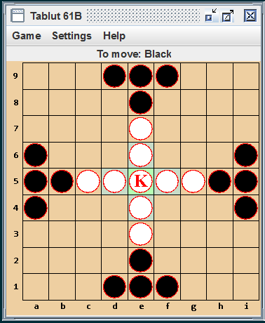

# Tablut
This is a simulator for the ancient game Tablut. Project 2 of CS 61B @ UCB Fall, 2019.

To view the spec document, click the hyperlink below.
[spec document](spec.pdf)

## Usage
1. Playing with GUI: ```java -ea tablut.Main --display```

    
    
1. Playing with command line: ```java -ea tablut.Main```
    - Commands:
        - ***new***: End any game in progress, clear the board to its initial position, and set the current player to black.
        - ***seed N***: If the AIs are using random numbers for move selection, this command seeds their random-number generator with the integer N. Given the same seed and the same opposing moves, an AI should always make the same moves. This feature makes games reproducible.
        - ***auto C***: Make the C player an automated player. Here, C is "black" or "white", case-insensitive.
        - ***manual C***: Make the C player a human player (entering moves as manual commands).
        - ***limit N***: Make N be the maximum number of moves that a player may make during the current game. A player loses if the game has not ended by the time he must make his (N+1)st move. The command is in error if either player has already made at least N moves. The move limit is removed by a new command. (A move limit is not a normal provision of Tablut; we've added it for testing convenience so that we can test whether a program can find a forced win within a given number of moves.)
        - ***dump***: Print the current state of the board in exactly the following format:
            ```
            ===
            - - - B B B - - -
            - - - - B - - - -
            - - - - W - - - -
            B - - - W - - - B
            B B W W K W W B B
            B - - - W - - - B
            - - - - W - - - -
            - - - - B - - - -
            - - - B B B - - -
            ===
            ```
            Here, K denotes the king, W another white piece (Swede) and B a black piece (Muscovite). You must not use the === lines for any other output).

        - ***quit***: Exit the program.